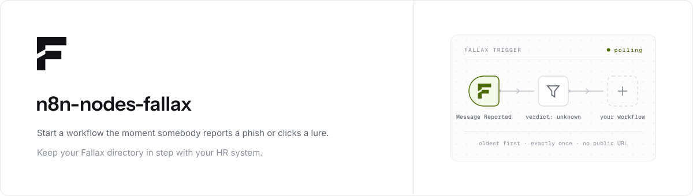

  <picture>
    <source media="(prefers-color-scheme: dark)" srcset="./.github/assets/banner-dark.svg">
    
  </picture>

  
  

  Start a workflow the moment somebody reports a phish or clicks a lure, 
  and keep your <a href="https://fallax.io">Fallax</a> directory in step with your HR system.

## Installation

**n8n Cloud**: search the nodes panel for **Fallax**.

**Self-hosted**: **Settings → Community nodes → Install**, then enter `n8n-nodes-fallax`.

## Credentials

1. In Fallax: **Settings → Integrations → n8n**, create a key.
2. Paste it into the **Fallax API** credential. Saving it checks the key and names the workspace it opens.

Keys belong to the workspace, not to you, so they survive your leaving. Shown once, stored as a hash. Read-only unless you grant write access, and no key of either scope can send a simulation.

## Operations

### Fallax Trigger

| Event | Fires when |
| --- | --- |
| Message Reported | Somebody reports a suspicious message, by mailbox, the Gmail button or Google's Alert Center. Filter by verdict: matched a simulation, or matched nothing Fallax sent and may be real. |
| Simulation Clicked | Somebody clicks a lure |
| Credentials Submitted | Somebody submits credentials to a simulated login page |
| Simulation Opened | Somebody opens a simulation |
| Any Simulation Event | All of those, plus sends and gateway scans |

Polls oldest first from a watermark, so an event arrives exactly once and in the order it happened. Activating starts from that moment rather than replaying your history.

### Fallax

| Resource | Operations |
| --- | --- |
| Report | Get Many |
| Event | Get Many |
| Campaign | Get, Get Many |
| Person | Get, Get Many, Create or Update, Update, Archive |
| Summary | Get |

**Create or Update** matches on email address, so a retried onboarding run never duplicates anybody. **Archive** takes a leaver out of the programme, keeps their evidence trail, and frees the seat.

## Usage

- **Triage real phishing.** Trigger on *Message Reported*, verdict *Unknown Only*, then open a ticket. Those are the messages staff flagged that Fallax did not send.
- **Chase a credential submit.** Trigger on *Credentials Submitted*, then message the person and their manager.
- **Sync joiners and leavers.** Your HR trigger, then *Person: Create or Update* or *Person: Archive*.
- **Report on the quarter.** Schedule, then *Summary: Get*, then post the rates to a channel.

## Compatibility

n8n 1.x on Node.js 20 and later, Cloud and self-hosted. The node polls over HTTPS, so a self-hosted instance needs no public URL.

Three limits worth knowing, none of which drop data: 500 rows per poll, 120 requests a minute per key, and fields owned by a Google or Microsoft directory sync are refused rather than silently reverted at the next sync. IP addresses and user agents are never returned.

## Resources

[API docs](https://fallax.io/docs/api) · [API reference](https://api.fallax.io/v1/reference) · [Integration page](https://fallax.io/integrations/n8n) · [n8n community nodes](https://docs.n8n.io/integrations/community-nodes/installation/)

## License

[MIT](LICENSE)
